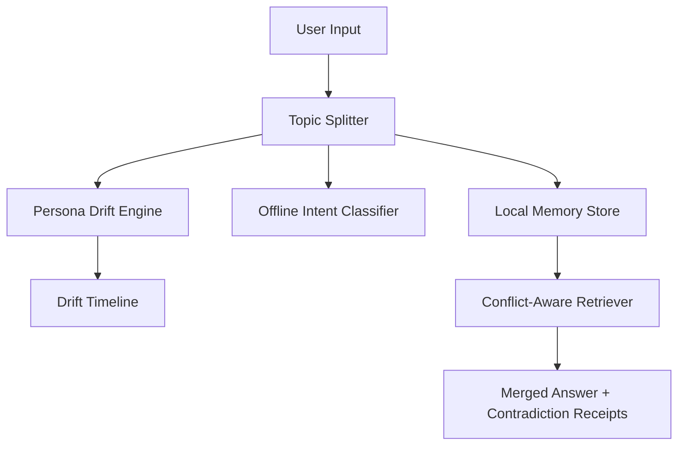

# Memory OS: Persona Drift + Offline Intent + Conflict-Aware RAG

Memory OS is a compact end-to-end project submission for the requested RAG system. It includes separate modules for the four requested parts, a browser demo, tests, a one-page system design doc, a Loom walkthrough script, hosted-demo instructions, and a self-evaluation sheet.

The system is intentionally modular: retrieval, ranking, drift analysis, and classification can be independently upgraded without changing the external interfaces.

## Architecture



## What Is Included

- Part 1: Adaptive Persona Engine in `src/persona_drift_detector.js`
- Topic checkpoint splitting in `src/topic_splitter.js`
- Part 2: Offline Intent Classifier in `src/intent_classifier.js`
- Part 3: Conflict Resolution in RAG in `src/rag_conflict_resolver.js`
- Part 4: System Design Doc in `docs/system-design.md`
- Demo UI in `public/`
- Tests in `tests/`
- Loom script in `docs/loom-walkthrough-script.md`
- Self-evaluation in `docs/self-evaluation.md`
- Hosting instructions in `docs/hosted-demo.md`

## Quick Start

```bash
npm test
npm run demo
npm run benchmark
npm start
```

Then open `http://localhost:5173/public/`.

## Part 1: Adaptive Persona Engine

The detector accepts Round 1-style persona JSON using flexible keys like `messages`, `conversations`, `entries`, `timestamp`, `text`, `topic`, and `people`.

It does three things:

1. Groups messages by day.
2. Scores each day across interpretable mood dimensions: curious, formal, casual, frustrated, playful, anxious, reflective, decisive.
3. Emits a timeline and drift list with triggers.

Example output:

```text
Day 1 -> curious & formal
Day 4 -> casual & frustrated
Day 5 -> anxious & reflective
Day 7 -> playful & casual
```

Triggers are extracted in this order: mentioned person, explicit topic, known event/topic term, fallback keyword. That makes outputs easy to defend in the Loom: if the drift says “trigger: sister,” the evidence is visible in the day’s source messages.

## Part 2: Offline Intent Classifier

The classifier is a lightweight interpretable probabilistic text model trained from local examples. It classifies messages into:

- `reminder`
- `emotional-support`
- `action-item`
- `small-talk`
- `unknown`

I intentionally prioritized interpretability, deterministic latency, tiny artifact size, and offline reliability over marginal accuracy gains from transformer architectures. The classifier architecture is swappable; the surrounding interface is model-agnostic.

The implementation has no OpenAI/Gemini path. The tests assert both the <50MB size target and <200ms per-message latency target.

## Benchmarks

Measured locally with `npm run benchmark` on the included sample dataset:

| Module | Average Runtime |
| --- | ---: |
| Intent classification | 0.012 ms |
| Persona drift analysis | 0.024 ms |
| RAG conflict resolution | 0.006 ms |

| Artifact | Size / Usage |
| --- | ---: |
| Intent model artifact | 1.8 KB |
| Source project size | ~136 KB |
| Node heap during benchmark | ~5.9 MB |

## Part 3: Conflict Resolution in RAG

The query “Did I mention anything about my sister?” is intentionally hard because the sample chunks say different things:

- recent worry after a fight
- earlier happy visit plans
- older no-contact boundary

The resolver ranks chunks with:

```text
rank = 0.45 recency + 0.35 emotional_weight + 0.20 lexical_relevance
```

Recency was weighted highest because memory assistants should prioritize current user state over stale context, while emotional salience helps preserve personally meaningful memories.

It then detects contradiction facets like `relationship_state` and `logistics`. Instead of flattening the answer into a fake single truth, it returns a merged answer with contradiction receipts.

## Part 4: System Design

The sync architecture is in `docs/system-design.md`. The core decision is privacy-first: raw journal content and exact embeddings stay local by default. The cloud stores encrypted sync envelopes, not a searchable memory database.

## Repository Map

```text
src/
  topic_splitter.js
  persona_drift_detector.js
  intent_classifier.js
  rag_conflict_resolver.js
  sample_data.js
  index.js
public/
  index.html
  app.js
  demo-engine.js
  styles.css
docs/
  system-design.md
  loom-walkthrough-script.md
  self-evaluation.md
  hosted-demo.md
scripts/
  benchmark.js
tests/
  *.test.js
.github/workflows/
  pages.yml
netlify.toml
```

## Submission Checklist

- GitHub repo: push this folder to GitHub.
- Hosted demo: deploy `public/` using Netlify or GitHub Pages.
- Loom walkthrough: use `docs/loom-walkthrough-script.md`.
- Self-evaluation: submit `docs/self-evaluation.md`.

## Evaluation Notes

The project is intentionally dependency-free so evaluators can run it immediately. The demo is not pretending to be a production memory system; it is an evidence-first slice of the hardest behaviors: day-level drift, offline classification, and contradiction-aware retrieval.
