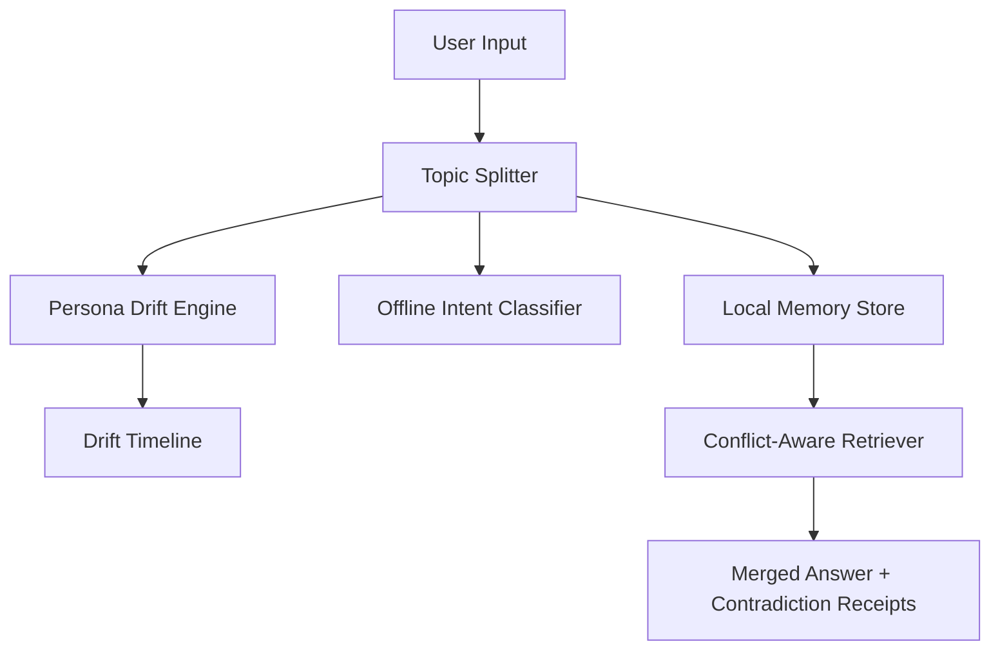

# Memory OS: Persona Drift + Offline Intent + Conflict-Aware RAG

Memory OS is my end-to-end project for building a more trustworthy personal-memory RAG layer. I focused on four things that matter in personal AI: temporal persona drift, offline intent classification, contradiction-aware retrieval, and privacy-conscious sync design.

The system is intentionally modular: retrieval, ranking, drift analysis, and classification can be independently upgraded without changing the external interfaces.

## Product Thesis

I did not build this as a generic chatbot wrapper. I built it as the evidence layer a personal AI system would need before it should answer sensitive questions about someone’s life.

My main decisions were:

- I treated personality as temporal instead of static. A user can be curious on Day 1, frustrated on Day 4, and playful on Day 7.
- I kept the intent classifier fully offline because routing private messages should not require an external LLM call.
- I made contradictions visible instead of flattening them into one clean but potentially false answer.
- I designed sync so raw memory can stay local while only encrypted summaries and metadata move across devices.
- I kept every module swappable so better retrieval, ranking, or classification models can replace the current implementation later.

## Architecture



## What Is Included

- Part 1: Adaptive Persona Engine in `src/persona_drift_detector.js`
- Topic checkpoint splitting in `src/topic_splitter.js`
- Part 2: Offline Intent Classifier in `src/intent_classifier.js`
- Part 3: Conflict Resolution in RAG in `src/rag_conflict_resolver.js`
- Part 4: System Design Doc in `docs/system-design.md`
- Demo UI in `public/`
- Tests in `tests/`
- Self-evaluation in `docs/self-evaluation.md`

## Quick Start

```bash
npm test
npm run demo
npm run benchmark
npm run static
```

## Production Backend

This branch adds a production-shaped Node backend without changing the core engine contracts.

```text
Frontend screen -> /api/persona/drift -> Persona Drift Engine
Frontend screen -> /api/intent/classify -> Offline Intent Classifier
Frontend screen -> /api/rag/resolve -> Conflict-Aware Retriever
Frontend screen -> /api/memory -> File-backed JSON memory store
```

Backend endpoints:

| Endpoint | Method | Purpose |
| --- | --- | --- |
| `/api/health` | GET | Backend health and mode check |
| `/api/persona/drift` | GET | Returns timeline and drift triggers |
| `/api/intent/classify` | POST | Classifies a message offline |
| `/api/rag/resolve` | POST | Resolves a query with contradiction receipts |
| `/api/memory` | GET | Returns the current seeded memory store |
| `/api/memory/messages` | POST | Adds a message to the persisted persona store |

The backend uses a simple file-backed JSON store in `data/` for demo persistence. `data/` is gitignored. In a real deployment, this can be swapped for Postgres, SQLite-on-disk, or encrypted object storage without changing the frontend API.

## Part 1: Adaptive Persona Engine

The detector accepts Round 1-style persona JSON using flexible keys like `messages`, `conversations`, `entries`, `timestamp`, `text`, `topic`, and `people`.

It does three things:

1. Groups messages by day.
2. Scores each day across interpretable mood dimensions: curious, formal, casual, frustrated, playful, anxious, reflective, decisive.
3. Emits a timeline and drift list with triggers.

Example output:

```text
Day 1 -> curious & formal
Day 4 -> casual & frustrated
Day 5 -> anxious & reflective
Day 7 -> playful & casual
```

Triggers are extracted in this order: mentioned person, explicit topic, known event/topic term, fallback keyword. I made this choice so the timeline is explainable: if the drift says “trigger: sister,” the evidence is visible in the day’s source messages.

## Part 2: Offline Intent Classifier

The classifier is a lightweight interpretable probabilistic text model trained from local examples. It classifies messages into:

- `reminder`
- `emotional-support`
- `action-item`
- `small-talk`
- `unknown`

I intentionally prioritized interpretability, deterministic latency, tiny artifact size, and offline reliability over marginal accuracy gains from transformer architectures. The classifier architecture is swappable; the surrounding interface is model-agnostic.

The implementation has no OpenAI/Gemini path. The tests assert both the <50MB size target and <200ms per-message latency target.

This was a deliberate systems decision. For this module, predictable local routing is more important than chasing marginal accuracy with a larger model that adds latency, hosting cost, or privacy risk.

## Benchmarks

Measured locally with `npm run benchmark` on the included sample dataset:

| Module | Average Runtime |
| --- | ---: |
| Intent classification | 0.012 ms |
| Persona drift analysis | 0.024 ms |
| RAG conflict resolution | 0.006 ms |

| Artifact | Size / Usage |
| --- | ---: |
| Intent model artifact | 1.8 KB |
| Source project size | ~136 KB |
| Node heap during benchmark | ~5.9 MB |

## Part 3: Conflict Resolution in RAG

The query “Did I mention anything about my sister?” is intentionally hard because the sample chunks say different things:

- recent worry after a fight
- earlier happy visit plans
- older no-contact boundary

The resolver ranks chunks with:

```text
rank = 0.45 recency + 0.35 emotional_weight + 0.20 lexical_relevance
```

Recency was weighted highest because memory assistants should prioritize current user state over stale context, while emotional salience helps preserve personally meaningful memories.

It then detects contradiction facets like `relationship_state` and `logistics`. Instead of flattening the answer into a fake single truth, it returns a merged answer with contradiction receipts.

This is the most important retrieval decision I made. Personal memory is often inconsistent because people change their mind, plans change, and emotions evolve. The system should say “there is conflicting evidence” instead of pretending the newest or loudest chunk is the whole truth.

## Part 4: System Design

The sync architecture is in `docs/system-design.md`. The core decision is privacy-first: raw journal content and exact embeddings stay local by default. The cloud stores encrypted sync envelopes, not a searchable memory database.

I intentionally designed the cloud as a courier, not the owner of memory. That makes first restore slightly less convenient because local indexes may need to be rebuilt, but it gives the project a much stronger privacy posture.

## Static vs Backend Versions

There are two versions of the project:

| Branch | Purpose |
| --- | --- |
| `main` | Static submission demo with no backend requirement |
| `production-backend` | Backend-backed production shape with API boundaries |

I kept `main` static because it is the most reliable form of the core system: the logic is visible, testable, and not dependent on provider credentials. The `production-backend` branch shows how the same architecture becomes a production-style web app with API boundaries and persistence.

## Repository Map

```text
src/
  server/
    app.js
  topic_splitter.js
  persona_drift_detector.js
  intent_classifier.js
  rag_conflict_resolver.js
  sample_data.js
  index.js
public/
  index.html
  app.js
  config.js
  demo-engine.js
  styles.css
docs/
  system-design.md
  self-evaluation.md
scripts/
  benchmark.js
tests/
  *.test.js
.github/workflows/
  pages.yml
netlify.toml
render.yaml
server.js
```

## Submission Checklist

- GitHub repo: push this folder to GitHub.
- Self-evaluation: submit `docs/self-evaluation.md`.

## Evaluation Notes

The project is intentionally dependency-free so evaluators can run it immediately. The demo is not pretending to be a production memory system; it is an evidence-first slice of the hardest behaviors: day-level drift, offline classification, and contradiction-aware retrieval.
